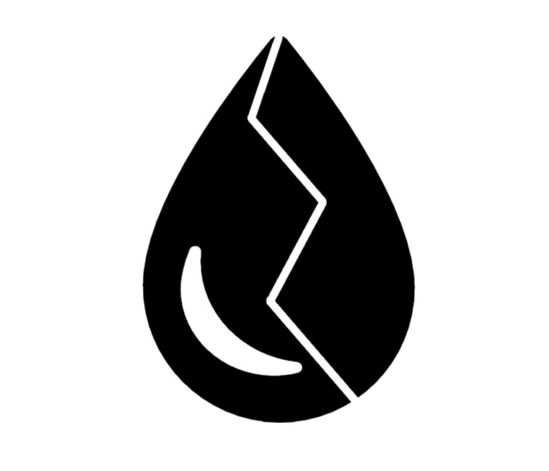

<!DOCTYPE html>
<html lang="es">

<head>
    <meta charset="UTF-8" />
    <meta http-equiv="X-UA-Compatible" content="IE=edge" />
    <meta name="viewport" content="width=device-width, initial-scale=1.0" />
    <link rel="stylesheet" href="../css/bootstrap.css" />
    <link rel="preconnect" href="https://fonts.googleapis.com" />
    <link rel="preconnect" href="https://fonts.gstatic.com" crossorigin />
    <link href="https://fonts.googleapis.com/css2?family=Roboto:ital@0;1&display=swap" rel="stylesheet" />
    <link rel="stylesheet" href="https://cdnjs.cloudflare.com/ajax/libs/animate.css/4.1.1/animate.min.css" />
    <link rel="shortcut icon" href="../images/DropRoto.png" />
    <title>Agua Del Atlantico | Error 404</title>
</head>

<body>
    <main class="container-fluid row d-flex align-items-center">
        

            

                <h1 class="display-1 fw-bold">Error 404</h1>
            

            

                
Se produjo un error al encontrar sitio solicitado.

            

            

                
Por favor, vuelva a la <a href="../index.html">Pagina de inicio</a> 

            

        

            
        

            
        

    </main>
</body>

</html>
